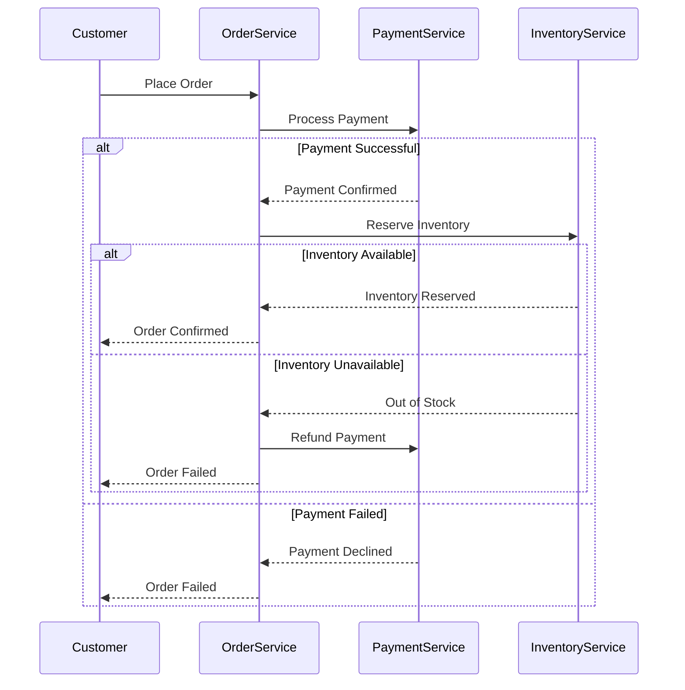
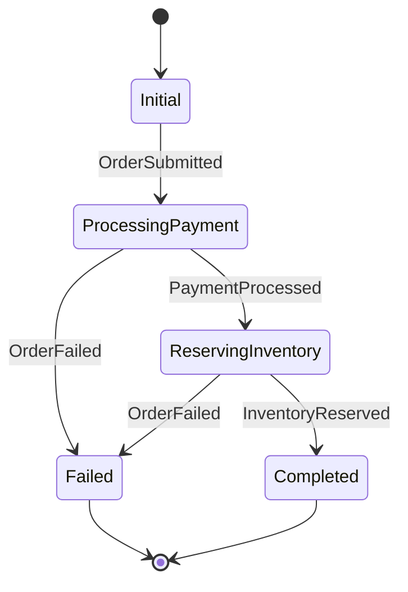

# Saga Pattern with MassTransit

## What is Saga?

A **saga** is a **sequence of local transactions**, where each transaction updates the state within a single service and **emits an event** or **calls the next service** in the chain.

If one transaction fails, the saga executes **compensating transactions** to undo the previous steps.

### 📦 Example

A simplified **e-commerce order flow**:

1. **Order Service**: Create order.
2. **Payment Service**: Deduct funds.
3. **Inventory Service**: Reserve items.

If payment fails, it must **cancel the order**. If inventory reservation fails, it must **refund** the payment and cancel the order.

Saga pattern handles this by:

* Defining forward steps (create order, deduct funds, etc.)
* Defining compensating steps (cancel order, refund, release inventory, etc.)

## Tech Stack
- .NET Aspire
- MassTransit + RabbitMQ
- PostgreSQL

## Features
- Orchestrates distributed transactions using the Saga pattern
- Models workflows with a Finite State Machine (FSM)
- Asynchronous communication via message queues

## Overview

Long-running business processes often involve multiple services working together. Think about an e-commerce order: you need to process the payment, update inventory, and notify shipping. Traditional distributed transactions using two-phase commit (2PC) seem like a solution, but they come with significant drawbacks.

The main issue? Services can't make assumptions about how other services operate or how long they'll take. What if the payment service needs manual approval? What if the inventory check is delayed? Holding database locks across multiple services for extended periods isn't practical and can lead to system-wide issues.

### Understanding the Saga Pattern

A Saga is a sequence of related local transactions where each step has a defined action and a compensating action if something goes wrong. Instead of one big atomic transaction, we break the process into manageable steps that can be coordinated.



Each step is independent and can be compensated if needed. If the inventory service reports items are out of stock, we can refund the payment. This approach gives us flexibility and reliability without tight coupling.

### State Machine Fundamentals

A state machine consists of several key components:
- **States**: Represent the possible conditions of your saga instance
- **Events**: Messages that can trigger state transitions
- **Behaviors**: Actions that occur when events are received in specific states
- **Instance**: Contains the data and current state for a specific saga

Here's the state machine diagram for our order processing saga:



Every state machine automatically includes `Initial` and `Final` states. The `Initial` state is where new saga instances begin, and the `Final` state marks the end of a saga's lifecycle.

## Takeaway

The Saga pattern with MassTransit provides a robust solution for managing distributed business processes. Instead of dealing with distributed transactions, you get clear state management, automatic compensation for failures, and the ability to handle long-running operations without blocking resources.

### Getting Started:
1. **Set Up the Database**
    - Add migrations for the `OrderSagaDbContext`:
      ```bash
      dotnet ef migrations add Initial --project src\Services\OrderService\OrderService.Api
      ```

2. **Run the Project**
    - Start the application, which would automatically apply the migrations to the PostgreSQL database.

3. **Place an Order**
    - Hit the `/orders` endpoint to trigger the order process.
